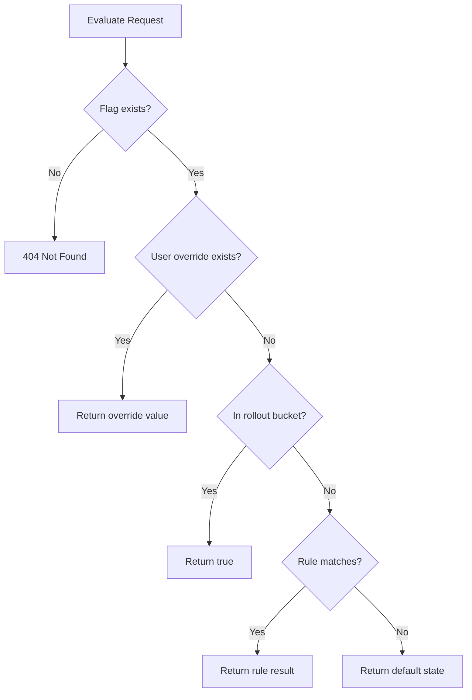

# Feature Flag Service

A lightweight Feature Flag management system built with **Spring Boot**, **Java 21**, **JPA (Hibernate)**, and **H2** (with optional **PostgreSQL** support).  
Supports dynamic feature rollout, rule-based evaluation, percentage-based rollouts, and per-user overrides.

---

## Problem Statement

Modern applications need the ability to:

- Enable or disable features without redeploying
- Gradually roll out features to a percentage of users
- Override feature behavior for specific users
- Evaluate feature flags based on rules and context (region, subscription tier, etc.)

This service provides a central feature flag system that client applications can query at runtime.

---

## System Architecture

### High-Level Design

```text
┌─────────────┐       REST API        ┌──────────────────────┐
│   Client    │ ────────────────────► │ FeatureFlagController│
│ Application │                       └──────────┬───────────┘
└─────────────┘                                  │
                                                 ▼
                                    ┌────────────────────────┐
                                    │   FeatureFlagService   │  ← CRUD
                                    │   EvaluationService    │  ← Runtime eval
                                    └──────────┬─────────────┘
                                               │
                                               ▼
                                    ┌────────────────────────┐
                                    │   JPA Repositories     │
                                    └──────────┬─────────────┘
                                               │
                                               ▼
                                    ┌────────────────────────┐
                                    │   H2 / PostgreSQL      │
                                    └────────────────────────┘
```
## Evaluation Flow
When a client evaluates a flag, the service applies logic in this order:

- Per-user override — if the user has an explicit override, that value wins
- Percentage rollout — deterministic hash on userId (e.g. 25% of users)
- Rule evaluation — attribute-based rules (planned)
- Default state — fallback when nothing else matches


### Validation & Error Handling

- Strict validation on all incoming API payloads using DTO-level validation.
- Graceful fallback to default feature state if:
  - Rule evaluation fails
  - Invalid user context is provided
  - Database is temporarily unavailable (future improvement)
- Global exception handling via `@RestControllerAdvice` ensures consistent API error responses.

### Testing Strategy

- Unit tests cover:
  - Rule evaluation logic
  - Rollout percentage decisions
  - Feature flag retrieval flow
- Service layer is designed to be mock-friendly for isolated testing
- Cache invalidation logic is planned for future enhancement testing

# API Design

The Feature Flag Service exposes RESTful APIs for creating, retrieving, and evaluating feature flags.

All APIs are prefixed with:


/api/feature-flags


---

## 1. Create Feature Flag

### `POST /api/feature-flags`

Creates a new feature flag with default state, rollout percentage, and optional rules.

### Request Body

```json
{
  "name": "dark_mode",
  "defaultState": false,
  "rolloutPercentage": 30,
  "rules": [
    {
      "attribute": "country",
      "operator": "EQUALS",
      "value": "IN",
      "enabled": true
    }
  ]
}
```
### Response
```json
{
  "id": 1,
  "name": "dark_mode",
  "defaultState": false,
  "rolloutPercentage": 30,
  "rules": [
    {
      "id": 1,
      "attribute": "country",
      "operator": "EQUALS",
      "value": "IN",
      "enabled": true
    }
  ]
}
```
## 2. Get Feature Flag by Name
GET /api/feature-flags/{name}

Fetch a feature flag configuration.

Example
GET /api/feature-flags/dark_mode
Response
{
  "id": 1,
  "name": "dark_mode",
  "defaultState": false,
  "rolloutPercentage": 30
}
## 3. Evaluate Feature Flag (Core API)
POST /api/feature-flags/evaluate

Evaluates whether a feature is enabled for a given user context.

Request Body
```json
{
  "featureName": "dark_mode",
  "userId": "user123",
  "attributes": {
    "country": "IN",
    "device": "mobile",
    "plan": "premium"
  }
}
```
Response
```json
{
  "featureName": "dark_mode",
  "enabled": true,
  "reason": "RULE_MATCH"
}
```
## Evaluation Flow
- Check default state
- Evaluate rules
- Apply rollout percentage
- Return result
