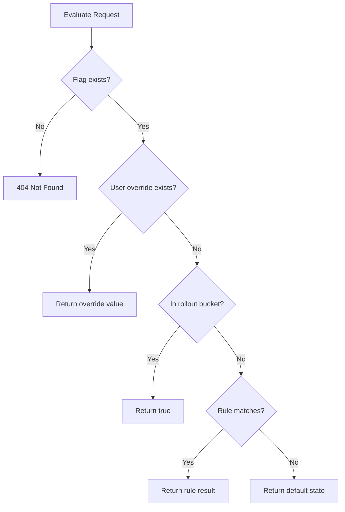

# Feature Flag Service

A lightweight Feature Flag management system built with **Spring Boot**, **Java 21**, **JPA (Hibernate)**, and **H2** (with optional **PostgreSQL** support).  
Supports dynamic feature rollout, rule-based evaluation, percentage-based rollouts, and per-user overrides.

---

## Problem Statement

Modern applications need the ability to:

- Enable or disable features without redeploying
- Gradually roll out features to a percentage of users
- Override feature behavior for specific users
- Evaluate feature flags based on rules and context (region, subscription tier, etc.)

This service provides a central feature flag system that client applications can query at runtime.

---

## System Architecture

### High-Level Design

```text
┌─────────────┐       REST API        ┌──────────────────────┐
│   Client    │ ────────────────────► │ FeatureFlagController│
│ Application │                       └──────────┬───────────┘
└─────────────┘                                  │
                                                 ▼
                                    ┌────────────────────────┐
                                    │   FeatureFlagService   │  ← CRUD
                                    │   EvaluationService    │  ← Runtime eval
                                    └──────────┬─────────────┘
                                               │
                                               ▼
                                    ┌────────────────────────┐
                                    │   JPA Repositories     │
                                    └──────────┬─────────────┘
                                               │
                                               ▼
                                    ┌────────────────────────┐
                                    │   H2 / PostgreSQL      │
                                    └────────────────────────┘
```
## Evaluation Flow
When a client evaluates a flag, the service applies logic in this order:

- Per-user override — if the user has an explicit override, that value wins
- Percentage rollout — deterministic hash on userId (e.g. 25% of users)
- Rule evaluation — attribute-based rules (planned)
- Default state — fallback when nothing else matches


### Validation & Error Handling

- Strict validation on all incoming API payloads using DTO-level validation.
- Graceful fallback to default feature state if:
  - Rule evaluation fails
  - Invalid user context is provided
  - Database is temporarily unavailable (future improvement)
- Global exception handling via `@RestControllerAdvice` ensures consistent API error responses.

### Testing Strategy

- Unit tests cover:
  - Rule evaluation logic
  - Rollout percentage decisions
  - Feature flag retrieval flow
- Service layer is designed to be mock-friendly for isolated testing
- Cache invalidation logic is planned for future enhancement testing
